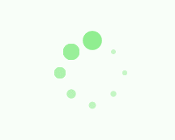

#用CSS3实现了几种常见的Loading效果，分享一下，顺便也当是做做笔记……

##第1种效果


```html
	<div class="loading">
	  	<span></span>
	  	<span></span>
	  	<span></span>
	  	<span></span>
	  	<span></span>
	</div>
```

```css
	<style>
	  .loading {
	        width: 80px;
	        height: 40px;
	        margin: 0 auto;
	        margin-top: 100px;
	    }

	    .loading span {
	        display: inline-block;
	        width: 8px;
	        height: 100%;
	        border-radius: 4px;
	        background: lightgreen;
	        -webkit-animation: load 1s ease infinite;
	    }

	    @-webkit-keyframes load {
	        0%, 100% {
	            height: 40px;
	            background: lightgreen;
	        }
	        50% {
	            height: 70px;
	            margin: -15px 0;
	            background: lightblue;
	        }
	    }

	    .loading span:nth-child(2) {
	        -webkit-animation-delay: 0.2s;
	    }

	    .loading span:nth-child(3) {
	        -webkit-animation-delay: 0.4s;
	    }

	    .loading span:nth-child(4) {
	        -webkit-animation-delay: 0.6s;
	    }

	    .loading span:nth-child(5) {
	        -webkit-animation-delay: 0.8s;
	    }
	</style>
```

##第2种效果


```html
	<div class="loading">
	  	<span></span>
	</div>
```

```css
	<style>
	    .loading {
	        width: 150px;
	        height: 4px;
	        border-radius: 2px;
	        margin: 0 auto;
	        margin-top: 100px;
	        position: relative;
	        background: lightgreen;
	        -webkit-animation: changeBgColor 1.04s ease-in infinite alternate;
	    }

	    .loading span {
	        display: inline-block;
	        width: 16px;
	        height: 16px;
	        border-radius: 50%;
	        background: lightgreen;
	        position: absolute;
	        margin-top: -7px;
	        margin-left: -8px;
	        -webkit-animation: changePosition 1.04s ease-in infinite alternate;
	    }

	    @-webkit-keyframes changeBgColor {
	        0% {
	            background: lightgreen;
	        }
	        100% {
	            background: lightblue;
	        }
	    }

	    @-webkit-keyframes changePosition {
	        0% {
	            background: lightgreen;
	        }
	        100% {
	            margin-left: 142px;
	            background: lightblue;
	        }
	    }
	</style>
```

##第3-5种效果


```html
	<div class="loading">
	  	<span></span>
	  	<span></span>
	  	<span></span>
	  	<span></span>
	  	<span></span>
	</div>
```

```css
	<style>
	    .loading {
	        width: 150px;
	        height: 15px;
	        margin: 0 auto;
	        margin-top: 100px;
	    }

	    .loading span {
	        display: inline-block;
	        width: 15px;
	        height: 100%;
	        margin-right: 5px;
	        border-radius: 50%;
	        background: lightgreen;
	        -webkit-animation: load 1.04s ease infinite;
	    }

	    .loading span:last-child {
	        margin-right: 0px;
	    }

	    @-webkit-keyframes load {
	        0% {
	            opacity: 1;
	        }
	        100% {
	            opacity: 0;
	        }
	    }

	    .loading span:nth-child(1) {
	        -webkit-animation-delay: 0.13s;
	    }

	    .loading span:nth-child(2) {
	        -webkit-animation-delay: 0.26s;
	    }

	    .loading span:nth-child(3) {
	        -webkit-animation-delay: 0.39s;
	    }

	    .loading span:nth-child(4) {
	        -webkit-animation-delay: 0.52s;
	    }

	    .loading span:nth-child(5) {
	        -webkit-animation-delay: 0.65s;
	    }
	</style>
```
```css
	<style>
	    .loading {
	        width: 150px;
	        height: 15px;
	        margin: 0 auto;
	        margin-top: 100px;
	    }

	    .loading span {
	        display: inline-block;
	        width: 15px;
	        height: 100%;
	        margin-right: 5px;
	        border-radius: 50%;
	        background: lightgreen;
	        -webkit-animation: load 1.04s ease infinite;
	    }

	    .loading span:last-child {
	        margin-right: 0px;
	    }

	    @-webkit-keyframes load {
	        0% {
	            opacity: 1;
	            -webkit-transform: scale(1.3);
	        }
	        100% {
	            opacity: 0.2;
	            -webkit-transform: scale(.3);
	        }
	    }

	    .loading span:nth-child(1) {
	        -webkit-animation-delay: 0.13s;
	    }

	    .loading span:nth-child(2) {
	        -webkit-animation-delay: 0.26s;
	    }

	    .loading span:nth-child(3) {
	        -webkit-animation-delay: 0.39s;
	    }

	    .loading span:nth-child(4) {
	        -webkit-animation-delay: 0.52s;
	    }

	    .loading span:nth-child(5) {
	        -webkit-animation-delay: 0.65s;
	    }
	</style>
```

```css
	<style>
	    .loading {
	        width: 150px;
	        height: 15px;
	        margin: 0 auto;
	        position: relative;
	        margin-top: 100px;
	    }

	    .loading span {
	        position: absolute;
	        width: 15px;
	        height: 100%;
	        border-radius: 50%;
	        background: lightgreen;
	        -webkit-animation: load 1.04s ease-in infinite alternate;
	    }

	    @-webkit-keyframes load {
	        0% {
	            opacity: 1;
	            -webkit-transform: translate(0px);
	        }
	        100% {
	            opacity: 0.2;
	            -webkit-transform: translate(150px);
	        }
	    }

	    .loading span:nth-child(1) {
	        -webkit-animation-delay: 0.13s;
	    }

	    .loading span:nth-child(2) {
	        -webkit-animation-delay: 0.26s;
	    }

	    .loading span:nth-child(3) {
	        -webkit-animation-delay: 0.39s;
	    }

	    .loading span:nth-child(4) {
	        -webkit-animation-delay: 0.52s;
	    }

	    .loading span:nth-child(5) {
	        -webkit-animation-delay: 0.65s;
	    }
	</style>
```

##第6-8种效果


```html
	<div class="loading">
	  	<span></span>
	</div>
```

```css
	<style>
	    .loading {
	        width: 150px;
	        height: 15px;
	        margin: 0 auto;
	        margin-top: 100px;
	        text-align: center;
	    }

	    .loading span {
	        display: inline-block;
	        width: 15px;
	        height: 100%;
	        margin-right: 5px;
	        background: lightgreen;
	        -webkit-animation: load 1.04s ease infinite;
	    }

	    .loading span:last-child {
	        margin-right: 0px;
	    }

	    @-webkit-keyframes load {
	        0% {
	            opacity: 1;
	        }
	        100% {
	            opacity: 0;
	        }
	    }

	    .loading span:nth-child(1) {
	        -webkit-animation-delay: 0.13s;
	    }

	    .loading span:nth-child(2) {
	        -webkit-animation-delay: 0.26s;
	    }

	    .loading span:nth-child(3) {
	        -webkit-animation-delay: 0.39s;
	    }

	    .loading span:nth-child(4) {
	        -webkit-animation-delay: 0.52s;
	    }

	    .loading span:nth-child(5) {
	        -webkit-animation-delay: 0.65s;
	    }
	</style>
```

```css
	<style>
	    .loading {
	        width: 150px;
	        height: 15px;
	        margin: 0 auto;
	        margin-top: 100px;
	    }

	    .loading span {
	        display: inline-block;
	        width: 15px;
	        height: 100%;
	        margin-right: 5px;
	        background: lightgreen;
	        -webkit-transform-origin: right bottom;
	        -webkit-animation: load 1s ease infinite;
	    }

	    .loading span:last-child {
	        margin-right: 0px;
	    }

	    @-webkit-keyframes load {
	        0% {
	            opacity: 1;
	        }
	        100% {
	            opacity: 0;
	            -webkit-transform: rotate(90deg);
	        }
	    }

	    .loading span:nth-child(1) {
	        -webkit-animation-delay: 0.13s;
	    }

	    .loading span:nth-child(2) {
	        -webkit-animation-delay: 0.26s;
	    }

	    .loading span:nth-child(3) {
	        -webkit-animation-delay: 0.39s;
	    }

	    .loading span:nth-child(4) {
	        -webkit-animation-delay: 0.52s;
	    }

	    .loading span:nth-child(5) {
	        -webkit-animation-delay: 0.65s;
	    }
	</style>
```

```css
	<style>
	    .loading {
	        width: 150px;
	        height: 15px;
	        margin: 0 auto;
	        margin-top: 100px;
	    }

	    .loading span {
	        display: inline-block;
	        width: 15px;
	        height: 100%;
	        margin-right: 5px;
	        background: lightgreen;
	        -webkit-transform-origin: right bottom;
	        -webkit-animation: load 1s ease infinite;
	    }

	    .loading span:last-child {
	        margin-right: 0px;
	    }

	    @-webkit-keyframes load {
	        0% {
	            opacity: 1;
	            -webkit-transform: scale(1);
	        }
	        100% {
	            opacity: 0;
	            -webkit-transform: rotate(90deg) scale(.3);
	        }
	    }

	    .loading span:nth-child(1) {
	        -webkit-animation-delay: 0.13s;
	    }

	    .loading span:nth-child(2) {
	        -webkit-animation-delay: 0.26s;
	    }

	    .loading span:nth-child(3) {
	        -webkit-animation-delay: 0.39s;
	    }

	    .loading span:nth-child(4) {
	        -webkit-animation-delay: 0.52s;
	    }

	    .loading span:nth-child(5) {
	        -webkit-animation-delay: 0.65s;
	    }
	</style>
```

##第9-10种效果




```html
	<div class="loadEffect">
	  	<span></span>
	  	<span></span>
	  	<span></span>
	  	<span></span>
	  	<span></span>
	  	<span></span>
	  	<span></span>
	  	<span></span>
	</div>
```

```css
	<style>
	    .loadEffect {
	        width: 100px;
	        height: 100px;
	        position: relative;
	        margin: 0 auto;
	        margin-top: 100px;
	    }

	    .loadEffect span {
	        display: inline-block;
	        width: 16px;
	        height: 16px;
	        border-radius: 50%;
	        background: lightgreen;
	        position: absolute;
	        -webkit-animation: load 1.04s ease infinite;
	    }

	    @-webkit-keyframes load {
	        0% {
	            opacity: 1;
	        }
	        100% {
	            opacity: 0.2;
	        }
	    }

	    .loadEffect span:nth-child(1) {
	        left: 0;
	        top: 50%;
	        margin-top: -8px;
	        -webkit-animation-delay: 0.13s;
	    }

	    .loadEffect span:nth-child(2) {
	        left: 14px;
	        top: 14px;
	        -webkit-animation-delay: 0.26s;
	    }

	    .loadEffect span:nth-child(3) {
	        left: 50%;
	        top: 0;
	        margin-left: -8px;
	        -webkit-animation-delay: 0.39s;
	    }

	    .loadEffect span:nth-child(4) {
	        top: 14px;
	        right: 14px;
	        -webkit-animation-delay: 0.52s;
	    }

	    .loadEffect span:nth-child(5) {
	        right: 0;
	        top: 50%;
	        margin-top: -8px;
	        -webkit-animation-delay: 0.65s;
	    }

	    .loadEffect span:nth-child(6) {
	        right: 14px;
	        bottom: 14px;
	        -webkit-animation-delay: 0.78s;
	    }

	    .loadEffect span:nth-child(7) {
	        bottom: 0;
	        left: 50%;
	        margin-left: -8px;
	        -webkit-animation-delay: 0.91s;
	    }

	    .loadEffect span:nth-child(8) {
	        bottom: 14px;
	        left: 14px;
	        -webkit-animation-delay: 1.04s;
	    }
	</style>
```

```css
	<style>
	    .loadEffect {
	        width: 100px;
	        height: 100px;
	        position: relative;
	        margin: 0 auto;
	        margin-top: 100px;
	    }

	    .loadEffect span {
	        display: inline-block;
	        width: 20px;
	        height: 20px;
	        border-radius: 50%;
	        background: lightgreen;
	        position: absolute;
	        -webkit-animation: load 1.04s ease infinite;
	    }

	    @-webkit-keyframes load {
	        0% {
	            -webkit-transform: scale(1.2);
	            opacity: 1;
	        }
	        100% {
	            -webkit-transform: scale(.3);
	            opacity: 0.5;
	        }
	    }

	    .loadEffect span:nth-child(1) {
	        left: 0;
	        top: 50%;
	        margin-top: -10px;
	        -webkit-animation-delay: 0.13s;
	    }

	    .loadEffect span:nth-child(2) {
	        left: 14px;
	        top: 14px;
	        -webkit-animation-delay: 0.26s;
	    }

	    .loadEffect span:nth-child(3) {
	        left: 50%;
	        top: 0;
	        margin-left: -10px;
	        -webkit-animation-delay: 0.39s;
	    }

	    .loadEffect span:nth-child(4) {
	        top: 14px;
	        right: 14px;
	        -webkit-animation-delay: 0.52s;
	    }

	    .loadEffect span:nth-child(5) {
	        right: 0;
	        top: 50%;
	        margin-top: -10px;
	        -webkit-animation-delay: 0.65s;
	    }

	    .loadEffect span:nth-child(6) {
	        right: 14px;
	        bottom: 14px;
	        -webkit-animation-delay: 0.78s;
	    }

	    .loadEffect span:nth-child(7) {
	        bottom: 0;
	        left: 50%;
	        margin-left: -10px;
	        -webkit-animation-delay: 0.91s;
	    }

	    .loadEffect span:nth-child(8) {
	        bottom: 14px;
	        left: 14px;
	        -webkit-animation-delay: 1.04s;
	    }
	</style>
```